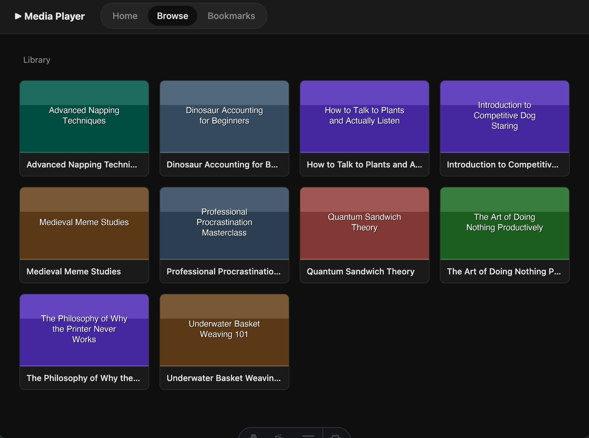
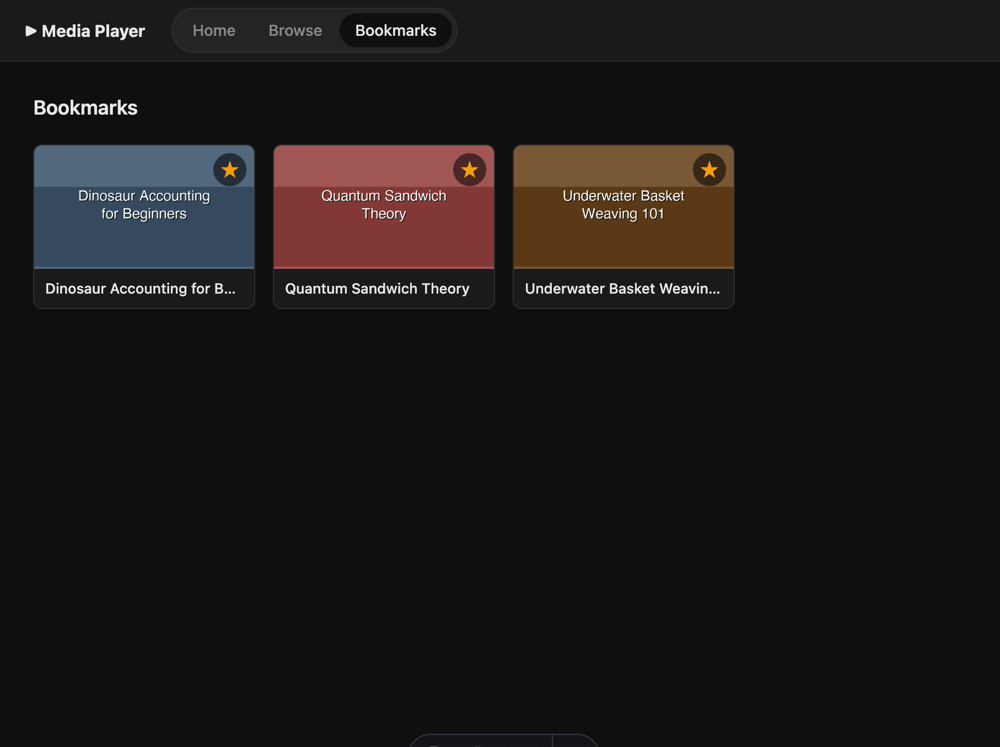

# Media Player

A personal self-hosted video player built as a vibe coding exercise with [Claude](https://claude.ai). The entire app — frontend, backend API, and database — lives in a single [Astro](https://astro.build) SSR project.

## Screenshots

**Browse**


**Bookmarks**


## Features

- Browse your video library through a card-based grid UI
- Folder poster images (`poster.png`) shown as thumbnails
- Video thumbnails auto-generated via a script (FFmpeg)
- Bookmark folders for quick access
- Video playback with HTTP range request support (seeking works)
- Watch progress saved every 5 seconds — resume from where you left off
- "Continue Watching" section on the homepage
- Dark theme

## Tech stack

- [Astro](https://astro.build) SSR with the Node adapter
- JSON file for persistence (`data/data.json`)
- Node.js built-ins for filesystem access and video streaming
- FFmpeg for thumbnail generation (external, run manually)

## Project structure

```
media_player/
├── library/          # Put your videos here (subdirectories supported)
├── thumbs/           # Generated thumbnails (mirrors library/ structure)
├── data/             # JSON data store (auto-created on first run)
├── scripts/
│   └── generate_thumbnails.py
├── src/
│   ├── lib/db.ts
│   ├── pages/
│   │   ├── index.astro         # Homepage: Continue Watching + Bookmarks
│   │   ├── browse.astro        # Filesystem browser
│   │   ├── bookmarks.astro     # Bookmarked folders
│   │   ├── watch.astro         # Video player
│   │   └── api/                # REST API routes
│   └── components/
└── public/
    └── styles/global.css
```

## Docker

The easiest way to run the media player. The image includes FFmpeg and Python so thumbnail generation works out of the box.

### Quick start

```bash
# Create the folders Docker will mount
mkdir -p library thumbs data

# Copy your videos into library/
# Then start the container
docker compose up -d
# → http://localhost:3000
```

### Generate thumbnails

```bash
# Thumbnails (one frame per video, stored in thumbs/)
docker compose exec media-player python3 scripts/generate_thumbnails.py

# Poster images (auto-generated cover art for each folder)
docker compose exec media-player python3 scripts/generate_posters.py
```

Re-run these whenever you add new videos. Existing files are skipped automatically.

The `library/`, `thumbs/`, and `data/` directories are mounted from the host, so thumbnails and posters persist across container restarts and image updates.

---

## Manual setup

### Requirements

- Node.js >= 22
- Python 3 (for thumbnail generation)
- FFmpeg (for thumbnail generation)

### Install

```bash
npm install
```

### Add your videos

Copy or symlink your video files into the `library/` folder. Subdirectories are fully supported.

Optionally add a `poster.png` inside any folder to use it as the folder thumbnail.

### Generate thumbnails

```bash
python3 scripts/generate_thumbnails.py
```

Re-run this whenever you add new videos. Existing thumbnails are skipped automatically.

Options:

```bash
# Capture frame at a specific timestamp (default: 10s)
python3 scripts/generate_thumbnails.py --timestamp 30

# Force regeneration of all thumbnails
python3 scripts/generate_thumbnails.py --force

# Custom paths
python3 scripts/generate_thumbnails.py --library /path/to/library --thumbs /path/to/thumbs
```

### Run (development)

```bash
npm run dev
# → http://localhost:3000
```

### Run (production)

```bash
npm run build
node dist/server/entry.mjs
```

Always run from the project root so the `data/`, `library/`, and `thumbs/` paths resolve correctly.

## Notes

- No authentication — designed for personal use on a private network
- Video formats supported: `.mp4`, `.mkv`, `.mov`, `.avi`, `.webm`, `.m4v`, `.flv`, `.ts`, `.wmv`
- The app only serves files inside the `library/` folder — no access to the rest of the filesystem
